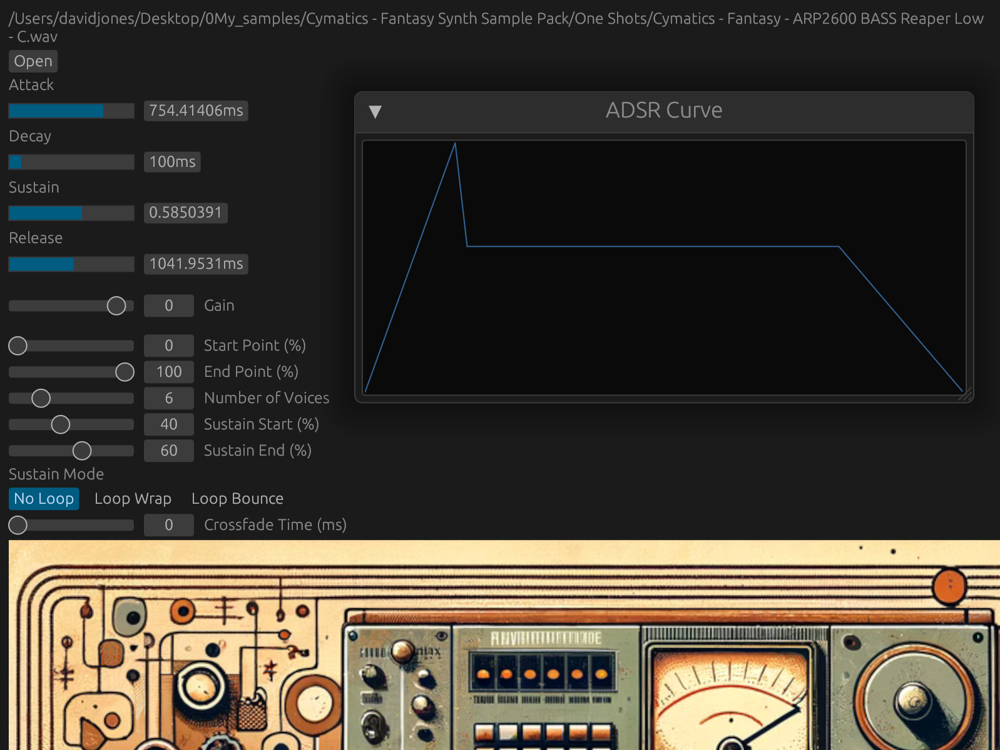

# Rust Sampler
#### Original Repo: [SAE2024_Final](https://github.com/SonyaInSiberia/SAE2024_Final)

## Compilation Steps

### After installing Rust and cloning this repository, you can compile Ase Example as follows:
demo video: https://youtu.be/IabgXZt028w
1. First enter the directory in which this repository is cloned. For instance: 'cd Desktop/SAE2024_Final/'

2. Then enter the RustSampler directory using 'cd RustSampler' 
   * If you would like to have the image at the bottom of the GUI, you will have to change the file path near line 384 to the path of your clone/fork of this repository

3. then run 'cargo xtask bundle RustSampler --release'

4. Then, in the 'RustSampler/Target/bundled/' directory there will be a RustSampler.vst3 file and a RustSampler.clap file

5. Move the file of your desired plugin format to your system's plug-in directory. For instance, on mac it might look like this: '/Library/Audio/Plug-Ins/VST3'

6. You can launch DAW in developer mode to see the terminal from the DAW, for instance, launch REAPER in developer mode using the command `$./REAPER -d` in the directory where REAPER is installed

7. When using the RustSampler, be sure to only load sfz and wav files. All other file formats will be ignored.

## SFZ Stuff

### If you would like to load sfz files into the sampler, some additional steps may be necessary
 * There is an example sfz file [here](https://github.com/SonyaInSiberia/SAE2024_Final/releases/tag/v1.0)
1. When you download the file, you will need to edit the paths in the sfz file that point to all of the audio files. This can be done using your preferred text editor and using a find and replace all to replace the currnent paths with your own.
   * This might look like this 'find: "auraaudio/Desktop/Salamander"  replace with: "your_user_name/Downloads/SFZ Files/Salamander Grand Piano" '
2. Once this is done, you should be able to navigate to that sfz file from the RustSampler and it should load immediately. If it does not load, there may be a problem with your file paths.
## GUI Image

## GUI Framework
The VST Plug-in GUI is achieved using [nig-plug-egui](https://github.com/robbert-vdh/nih-plug/tree/master/nih_plug_egui) crate based on [egui baseview](https://github.com/BillyDM/egui-baseview). The ADSR envelope visualization is achieved using `epaint` from `egui` crate.

